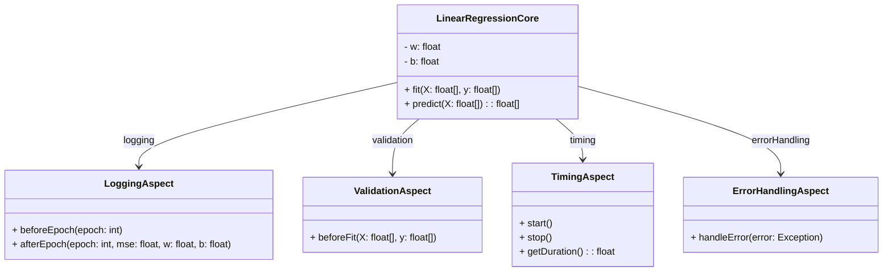

# 2. Usando el paradigma de Aspectos, diseñe una solución que realice la regresión lineal. (NOTA: igual que el punto 1, debe hacer el diseño y no la implementación. Sea muy detallista con el diseño)
## Solución: 

## Explicación: 

### LinearRegressionCore
Aspecto encargado de encontrar la línea recta que mejor ajusta los datos y luego usarla para hacer predicciones.

**Atributos:**
- **w** (`float`): inclinación de la línea, muestra cómo reacciona el resultado cuando el dato de entrada sube uno.
- **b** (`float`): punto donde la línea toca el eje vertical, es el arranque de la función.

**Métodos:**
- `fit(X: float[], y: float[])`: aprende con los datos y ajusta w y b.
- `predict(X: float[])`: usa w y b para sacar resultados nuevos.

---
### LoggingAspect
Aspecto encargado de guardar información en cada ronda del entrenamiento, como el error y los valores de los parámetros.

**Métodos:**
- `beforeEpoch(epoch: int)`: corre justo antes de cada nueva vuelta y puede marcar en qué paso va.
- `afterEpoch(epoch: int, mse: float, w: float, b: float)`: corre al terminar cada vuelta y anota el error y los parámetros actuales.

---

### ValidationAspect
Aspecto encargado de revisar los datos antes de entrenar para evitar problemas con tamaños, valores faltantes o datos raros.

**Método:**
- `beforeFit(X: float[], y: float[])`: revisa los datos antes de que se empiece a buscar la mejor línea.
---
### TimingAspect
Aspecto encargado de medir cuánto tiempo dura todo el entrenamiento.

**Métodos:**
- `start()`: arranca el cronómetro.
- `stop()`: detiene el cronómetro.
- `getDuration(): float`: dice cuánto tiempo total se llevó el proceso.

---
### ErrorHandlingAspect
Aspecto encargado de atrapar cualquier error que ocurra durante el entrenamiento o la predicción